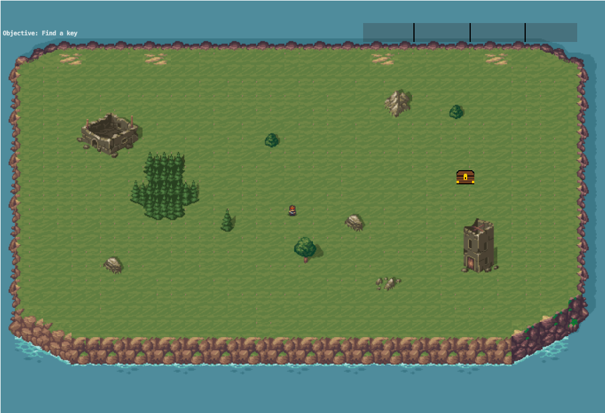

# [Escape-Island](https://ianluzhao.github.io/Escape-Island)

## About

A survival adventure game built with Defold in 2023.

Originally created for an English project about learning something new. This game was the result of that journey.

## Gameplay

You are stranded on a mysterious island and must find a way to escape. Explore the environment, use the arrow keys to move the charactor around, rummage through plants and collapsed buildings, and gather resources to craft your way to freedom.

## Features

- Exploration-based gameplay
- Resource gathering and crafting
- Atmospheric island environment
- Built with Defold game engine

## What I Learned

This was my first time actually building a game, and honestly, I learned way more than I expected:

- **Game Engine Basics**: Defold was pretty new to me, so I spent a lot of time figuring out how game loops work, how to get sprites to show up on screen, and how collision detection actually functions. It's way more complicated than I thought!
- **Keeping Track of Everything**: Managing all the game state stuff like inventory, resources, and the crafting system was a headache at first. I had to learn how to organize everything so it wouldn't turn into spaghetti code.
- **Making It User-Friendly**: I realized pretty quickly that what makes sense to me doesn't always make sense to other people. Had to think a lot about controls and how to guide players without being too obvious about it.
- **Working with Assets**: I got to mess around with sprites, animations, and sound effects. It's actually really cool seeing everything come together to make the game feel more alive.
- **Not Biting Off More Than I Can Chew**: I originally had way bigger plans for this game, but I learned to scale things down to what I could actually finish. Turns out time management is super important.
- **Testing and Fixing Stuff**: Had friends playtest it and got a lot of feedback. Changed things around multiple times based on what was confusing or what didn't work well.

Overall, it was tough but pretty rewarding to see something I coded actually turn into a game people can play. Definitely want to do more projects like this.

## Play Now

[Launch Game](https://ianluzhao.github.io/Escape-Island)

